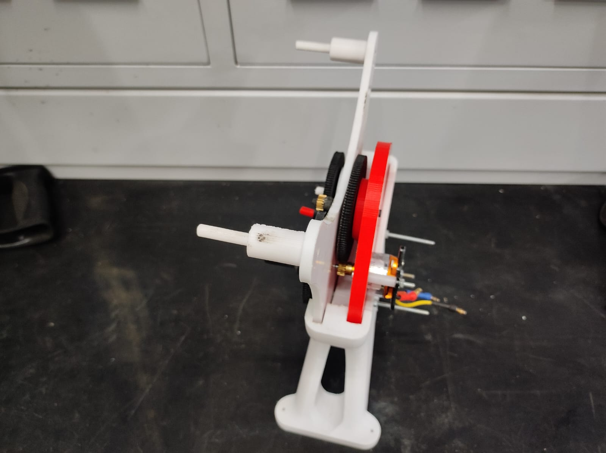

#  RC Ornithopter Project

##  GEARBOX
For our RC Ornithopter, the gearbox is most crucial element which is responsible for reducing the high-speed rotation of the BLDC motor into a slow, powerful, and controlled flapping motion.Gearbox function is to reduce the speed of the input from the motor, while also multiplying the torque the input creates. The challenge was to design a gearbox that is lightweight, compact, durable, and efficient, while also achieving the large reduction ratio. After exploring various options we arrived at an afficient gearbox.

###  **Calculation of Reduction Ratio**
For our **Ornithopter**, we needed a gearbox that was **lightweight, compact, low-friction, and capable of handling high torque with large reduction ratios**.  

We selected a **BLDC motor of 1400 KV** and targeted a **flapping frequency of 5 Hz**. Using an **11.1V battery**, the motor theoretically spins at:  

\[
11.1 x 1400 = 15,540  RPM
\]  

According to the datasheet of the **A2212 10T BLDC motor**, it runs at about **80% efficiency**, which brings it down to:  

\[
15,540 x 0.85 = 13,209 RPM
\]  

To scale this down to **300 RPM (5 Hz flapping)**, we needed a gear reduction of approximately **44:1**.  

---

## **Challenges**

 1.Our 3D printers limited us from printing pinions smaller than 20 mm and gears with very fine modules, which restricted design flexibility.

 2.Since the gearbox needed to be compact, we could not exceed a 10 cm diameter for any gear stage.

 3.With strict weight constraints, we had to minimize the number of gears — meaning we had to achieve a high reduction ratio in fewer stages, without compromising     efficiency

##  **Implemented Gearbox**

Finally, we achieved our working solution.  

Since we couldn’t print pinions smaller than **20 mm**, so we purchased two 18-teeth pinions (module 0.529) from Robu.  
With these, we achieved the required reduction in just two stages:  

- **Stage 1:** 18T pinion → 128T gear → **7.11:1 reduction**  
- **Stage 2:** 18T pinion → 114T gear → **6.33:1 reduction**  

The diameter of pinion is **9.522mm** with a weight of around 5grams while that of 128T gear is **67.712mm** with a weight of 28.5g which is used in the 1st stage.
The 2 gears of 114 teeths each on which the crank is mounted has a diameter of **60.306mm** and a weight of 26g each making our gearbox compact in size and light weight(the weights are calculated considering carbon fiber as material).

 **Final reduction ratio:**  
\[
7.11 x 6.33 = 45.03
\]  

TO due this **Small PInion** we were able to give high reduction in just 2 stages to make our gearbox a **lightweight, efficient gearbox**.   

---

---

 This is our final gearbox for our **RC Ornithopter gearbox** by maintaining a balance between **weight, durability, and efficiency**!
