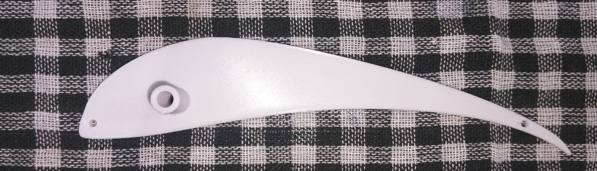

#  RC Ornithopter Project
---
##  Project Structure
- **Gearbox** → Design of multi-stage reduction gearbox.
- **Wing Mechanism** → 4-bar flapping mechanism.
- **Wing Design** → Aerodynamic design of the wings.
- **Electronics** → Control system and power electronics.

### Table of Contents

- [Overview](#rc-ornithopter)
- [Gearbox](.Gearbox/README.md)
  - [Introduction](./Gearbox/README.md#gearbox)
  - [Calculation of Reduction Ratio](./Gearbox/README.md#calculation-of-reduction-ratio)
  - [Challenges](./Gearbox/README.md#challenges)
  - [Implemented Gearbox](./Gearbox/README.md#implemented-gearbox)
  - [Images](./Gearbox/README.md#implemented-gearbox)

- [Wing Mechanism](./Wing_Mechanism/README.md)

- [Wing Design](./Wing_Design/README.md)
- [Wing Design](./Wing_Design/README.md#wing-design)  
  - [Membraned Wing](./Wing_Design/README.md#membraned-wing)  
    - [Challenges Faced](./Wing_Design/README.md#challenges-faced)  
  - [Aerofoiled Wing](./Wing_Design/README.md#aerofoiled-wing)  
    - [Prototyping Process](./Wing_Design/README.md#prototyping-process)  

- [Electronics](./Electronics/README.md)

- [Onshape Design](https://cad.onshape.com/documents/YourOnshapeDocumentID)  

#  RC Ornithopter  

An RC Ornithopter is a bio-inspired aircraft that flies by flapping its wings, much like birds, bats, and insects. Unlike traditional fixed-wing or rotary aircraft that rely on propellers, the ornithopter uses wing motion to generate both lift and thrust.   

This project focuses on the design and development of a remote-controlled ornithopter with a **1.3 m wingspan**. The mechanical system includes a 2-stage spur gear reduction gearbox to convert high motor RPM into strong wing-flapping , paired with a **4-bar wing mechanism** that ensures smooth and symmetric wing motion flapping at **5 Hz frequency**.  

To maximize aerodynamic performance, we have used the **S1223 aerofoil** for the wings, chosen for its optimal aspect ratio, lift-to-drag ratio, and lightweight structural efficiency that balance **lift, stability, and strength**.  

The ornithopter is powered by a **1400 KV BLDC motor**, controlled with a **30A ESC**, and powered by a **1000mAh 30C Li-Po battery**. Overall, this project combines **aerodynamics, mechanical design, and electronics** to create a working prototype that demonstrates the **feasibility of flapping-wing flight**.  

  
  

  
---

## Gearbox  

The gearbox is the core mechanical component whose purpose is to convert the high-speed, low-torque rotation of the BLDC motor into an optimum-speed, high-torque, and controlled flapping motion.  

We designed a compact 2-stage gearbox that achieves a final reduction ratio of **45:1**, bringing the motor’s **12,432 RPM** (considering 80% efficiency of the BLDC motor) down to **300 RPM (5 Hz flapping frequency)**.  

By balancing **weight (less than 100 g)**, durability, and efficiency, this gearbox ensures the wings flap with enough torque and optimum speed for **sustained and efficient flight**.  

  
  

  

---

## Wing Mechanism  
---

##  Wing Design  

The wings are the **primary lift and thrust generating components** of our RC Ornithopter, and their design was one of the most critical challenges. We explored two major approaches:  

1. **Membraned Wing** – A flexible fabric stretched over a frame, lightweight and naturally adaptable.  
2. **Aerofoiled Wing** – A rigid aerodynamic profile designed for maximum lift efficiency.  

The membraned wing offered lightweight construction but faced practical issues: difficulty in finding materials, failed heat shrinking, and unreliable stitching/tension. After trials with umbrella fabric (PET), this design was abandoned.  

The final choice was the Aerofoiled Wing specifically using the **S1223 aerofoil**, known for its excellent lift-to-drag ratio and similarity to bird wings (e.g., seagull). Our prototyping combined 3D-printed ribs with lightweight foam covered in PET fabric for laminar airflow.  

This design resulted in a lightweight, durable, and aerodynamically efficient wing, far superior to the membraned version, and capable of supporting sustained flight.  

  
  

  

---
## Electronics  

The **electronics system** provides power, control, and wireless communication. The goal was to build a lightweight yet reliable setup that could deliver enough power while enabling precise control of the ornithopter’s flapping frequency via wireless input from a transmitter and receiver.  

We used a **1400 KV A2212/10T BLDC motor (68 g)** powered by a **1000mAh 11.1V 30C Li-Po battery (80 g)**. The motor is driven through a **30A Electronic Speed Controller (ESC)**, ensuring smooth conversion of electrical energy into mechanical flapping motion.  

For control, an **ESP32 microcontroller** was selected, paired with the **nRF24L01 radio module** for wireless communication. This enabled us to transmit control inputs remotely in real time.

The components were carefully chosen to balance weight and functionality. Despite challenges with libraries and toolchains (ESP-IDF vs. Arduino IDE), the system now enables precise and smooth control of the gearbox and wing mechanism.  

  
  

  

---
##ONSHAPE LINK

You can view the full **Onshape CAD model** of the Ornithopter [CAD][onshape].

[onshape]: https://cad.onshape.com/documents/7e51fa35739853501e9f122a/w/9d3130ef820e21c89fae6eac/e/79e030b13582ccec2b7b5b67?renderMode=0&uiState=68bc1015e50a472c7cab4d18

---