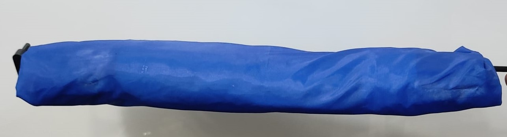

#                     Wing Design  

While designing the **ornithopter wing**, we had two major options:  
1. A **Membraned wing**  
2. An **Aerofoiled wing**  

After exploring references and experiments, we initially attempted the membraned wing. Later, due to practical challenges, we moved towards the aerofoiled wing design.  

For our ornithopter with a **wingspan of 130 cm**, the inner wing was designed to be **24 cm**, and the outer wing **46 cm**, with an average **wing width of ~30 cm**.  

---

## Membraned Wing  

A **membraned wing** is a lightweight design where a flexible, sail-like membrane is stretched over a skeletal frame, mimicking the structure and motion of bat and bird wings. Its natural adaptability helps smoothen airflow, reduce drag, and even generate extra lift without additional energy input.  

We considered materials such as **nylon, mylar, or other parachute-like heat-shrinkable fabrics**. Based on references, an **elliptical wing shape** was chosen, as its larger span(wing area) could provide a significant amount of lift.  

### Challenges Faced  
- The required fabric materials were difficult to find; after much searching, we obtained a lightweight **umbrella fabric (PET)**.  
- Heat shrinking the PET fabric failed.  
- Stitching the membrane onto the skeleton was not feasible.  
- Using **eyelets** to tie the membrane gave partial success but did not achieve the desired tension and smoothness.  

Due to these limitations, the membraned wing design was eventually abandoned, and focus shifted to an aerofoiled wing.  

 Membraned Wing 
 

  
    

---

## Aerofoiled Wing  

An **Aerofoiled wing** is a rigid, curved wing structure that generates lift efficiently by maintaining a pressure difference between its upper and lower surfaces. The optimized aerodynamic profile minimizes drag and maximizes lift, making it ideal for **sustained and efficient flight**.  

During our research, we found that the **S1223 aerofoil**, with its lift-to-drag ratio and Reynolds number characteristics, closely resembled seagull wings.  

###  Prototyping Process
- Initially, we **3D-printed the S1223 aerofoil** and tested it with a heat-shrinkable tube. However, the result was too heavy.  
- To solve this, we cut lightweight plastic foam into the aerofoil shape and sandwiched it between **two 3D-printed aerofoil ribs**.  
- This structure was then covered with umbrella fabric (PET), fastened tightly using adhesive and mechanical fasteners.  

This new design proved to be much lighter  than the heat-shrinkable version.  

 Aerofoiled Wing 
 

  
  

## RESOURCES

[Wings PDF](./assets/wing.pdf)

