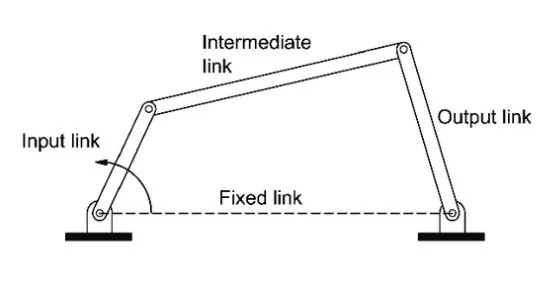
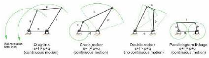
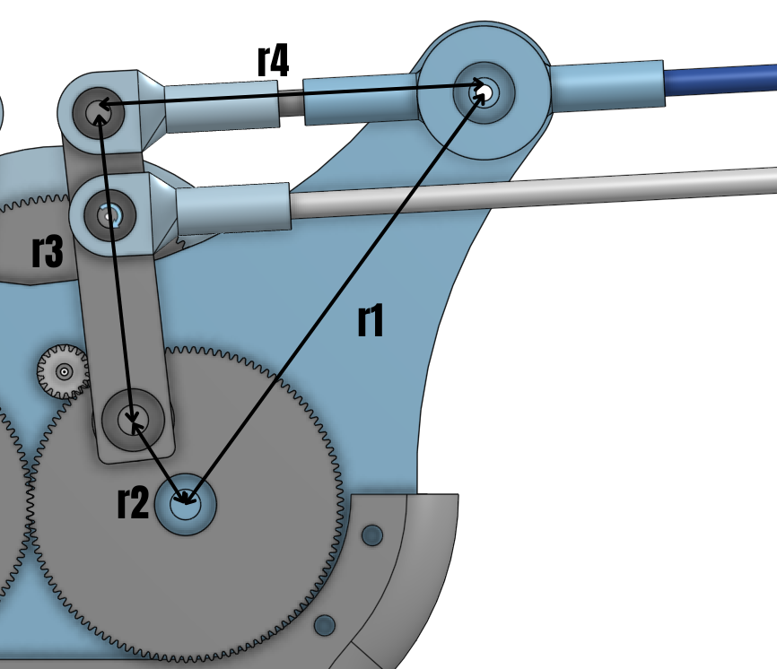
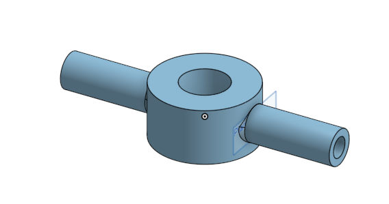
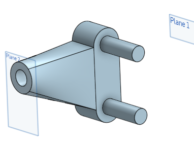
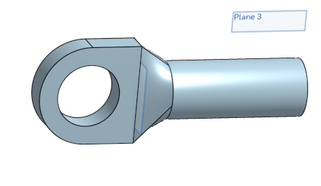

# Wing Mechanism – Flapping & Folding System

This repository documents the **mechanical design of a flapping and folding wing mechanism** inspired by bird flight.  
The mechanism uses **four–bar linkages** operating under **Grashof’s condition** so that a motor–driven crank provides continuous motion, while the output link (rocker) produces controlled wing flapping. A second four–bar handles wing folding.

---

## 1) Four–Bar Linkage: a 30-second primer

A **four–bar linkage** is the simplest closed–chain mechanism made of four rigid links joined by four revolute joints:

- **Ground (fixed) link** — the base between the two grounded pivots.  
- **Input link (crank)** — the motor–driven link.  
- **Coupler** — the floating link connecting input and output.  
- **Output link (rocker)** — delivers the useful oscillation.

Four–bars are widely used to convert **continuous rotation** into **oscillating** or **complex** motion with precise geometry control.

---

## 2) Grashof’s Condition (can a link rotate fully?)

For links of lengths L (longest), S (shortest) and the remaining two P, Q, **Grashof** states:

[ S + L <= P + Q => At least one link can rotate fully (360 deg). ]

 Flapping mechanism dimensions:

| Link | Length (mm) |
|---|---:|
| Ground (r1) | 98.8 |
| Input/Crank (r2) | 19.3 |
| Coupler (r3) | 60.0 |
| Output/Rocker (r4) | 75.0 |

Classification check:

- Shortest S = 19.3 (crank)  
- Longest L = 98.8 (ground)  
- Others P = 60.0, Q = 75.0  
-  S+L = 118.1, P+Q = 135.0 => 118.1 <= 135.0  (satisfied)

 Grashof satisfied -> the shortest link (crank) can rotate fully relative to its neighbors. With the ground adjacent to the shortest link, this is a **crank–rocker** mechanism (continuous crank, oscillating rocker).

---

## 3) Flapping Mechanism Geometry & Result

**Given dimensions** (mm):  
- Input/Crank r2 = 19.3  
- Coupler r3 = 60.0  
- Output/Rocker r4 = 75.0  
- Ground r1 = 98.8

**Kinematic model** (grounded pivots at (0,0) and (r1, 0)):

- Crank tip: B = (r2*cos(theta2), r2*sin(theta2))  
- Rocker tip: D = (r1 + r4*cos(theta4), r4*sin(theta4))  
- Coupler constraint: distance BD = r3

Solution for theta4 can be found using :
r1 + r2 * e^(i*theta2) = r3 * e^(i*theta3) + r4 * e^(i*theta4)

### Computed flapping result 

Sweeping the crank through 0–360 deg and tracking a single assembly mode yields:

- **Rocker angle (absolute, wrt ground):** from **127.87 deg** to **157.89 deg**  
- **Flapping amplitude (peak-to-peak):** **30.02 deg**

Interpretation: the output link (rocker) oscillates by about **30.0 deg** each cycle.

---

## 4) Folding Mechanism (second four–bar)

To mimic avian **wing folding** during parts of the stroke, a **second four–bar** is used (also run under Grashof). In your design:

- **Input link**: 20 mm  
  - One end at the **coupler–rocker joint** of the flapping mechanism.  
  - The other at the **coupler link** of the flapping mechanism.  
- **Output link**: connected to the **outer-wing rod** (drives folding).  
- **Equal remaining links**: 230 mm each.

.png)

From sizing: **Inner wing length** = 230 − 75 = **155 mm**.  

---

## 5) Math Notes (how the angles are solved)

###  Vector loop (complex form)

r1 + r2 * e^(i*theta2) = r3 * e^(i*theta3) + r4 * e^(i*theta4)

Eliminate theta3 to get a single equation in theta4 (Freudenstein form), then solve for theta4(theta2).

---
## 6) Prototyping and assembly of the mechanism 
 The prototyping we did was in 2 phases.
 ### 1) 3D-Printing all the parts with high infill density using PLA
  * This was our first attempt to **fabricate** and **assemble** the mechanism.

  
  * It had some **Degrees of freedom** at the various joints therefore it wasn't ready to work on a **motor** or at **high frequency**.
  * Then we worked on improvising the mechanism using stoppers and some design changes to achieve a smooth motion

  
  * After successfully completing the assembly we further worked on the design of gearbox and how to integrate it with motor.
  ### 2) Using carbon fiber rod for better structural functionalites
 * After successfully making the optimal design for gearbox we started to use carbon fiber rods for our mechanism.
 * Made seperate attachments to integrate them with the rods to make the mechanism work.
---

  
  
  

---

 * This was the final testing of the carbon fiber based mechanism.
---
 

---

